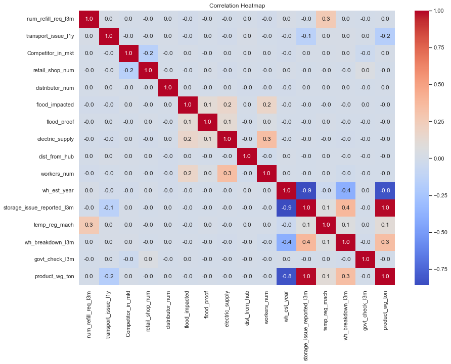

# FMCG-supply-chain-optimization
## Table Of Contents
-[Description](#description)
  - [About the Project](#about-the-project)
  - [Why This Project](#why-this-project)
- [Data](#data)
  - [Dataset](#dataset)
  - [Filtering](#filtering)
- [Methodology](#methodology)
  - [Regression Model](#regression-model)
  - [Optimization Model](#optimization-model)
- [Visualizations](#visualizations)
- [Results](#results)
- [Conclusion](#conclusion)
- [Author](#author)

---

## Description
### About the Project

In this project I have chosen a dataset from [Supply Chain Optimization for a FMCG Company](https://www.kaggle.com/datasets/suraj9727/supply-chain-optimization-for-a-fmcg-company/data) that has information related to the business of a leading FMCG company. You can view the dataset ['here'](FMCG_data.csv). 

### Why This Project

This project involves **Machine Learning** and **Operations Research** by predicting the product supply to warehouses using the given data by performing a simple linear regression fit and then optimizing using real world constraints to determine the optimal amount of product to be sent to each warehouse. This is done using the Python libraries **pandas**, **seaborn**, **cvxpy**, **Matplotlib** and **scikit-learn**. 

## Data
### Dataset

The dataset contains information on 25000 warehouses about the warehouse ID, location type and zone, market competitors, frequency of issues in transport, storage etc. The columns contain a mix of numerical and alphabetical values. For modelling purpouses, only the numerical values were used.

### Filtering

In order to determine the relevant features to predict the value of 'product_wg_ton', the following correleation heatmap was used:

From the heatmap, it can be seen that the four variables `storage_issue_reported_l3m`, `wh_est_year`, `wh_breakdown_l3m`, `transport_issue_l1y` were the most relevant, and hence were chosen as the features for the regression model. After dropping the rows with empty cells in these columns, the 12,851 remaining rows were used for prediction and optimization.

## Methodology

### Regression
- Used a correlation Heatmap to determine significant features affecting product weight
- Built a linear regression model using `sklearn`
- Used features like:
  - `storage_issue_reported_l3m`
  - `wh_est_year`
  - `wh_breakdown_l3m`
  - `transport_issue_l1y`
- Achieved an **R² score of 0.969**
- Validated with MAE and residual plots

### Optimization
- Used `cvxpy` to solve a constrained optimization problem:
  - Minimize squared deviation from predicted supply
  - Penalize high transport distances
- Applied constraints:
  - Non-negative supply
  - Supply <= workers x worker_ratioratio
- Tuned constraints using two key parameters:
  - `alpha` (distance penalty)
  - `worker_ratio` (supply limit per worker)
- The final optimized supply values (in `optimized_supply_output.csv`) were generated using:
  - `worker_ratio = 500`
  - `alpha = 0.1`
  This configuration balances predicted demand with transportation cost while allowing warehouses to receive higher quantities if workforce allows.

## Key Visualizations
- Histogram of product weight distribution
- Correlation Heatmap of features
- Actual vs. Predicted product supply
- Residual plot for model bias
- Predicted vs, Optimized supply for different parameters

## Insights
- Limits of worker_ratio strongly influence optimized values
- Distance penalty causes supply to avoid far warehouses
- Optimized values are closeto predicted values when feasible
- Outliers in residuals suggest rare warehouse types

## Limitations
- Rounding can be applied during implementation to avoid fractional product weights
- Only 12581 out of 25000 warehouses were included in optimization due to missing values in key features
