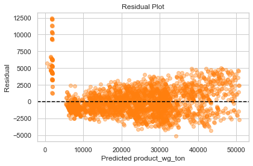
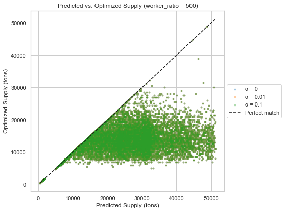
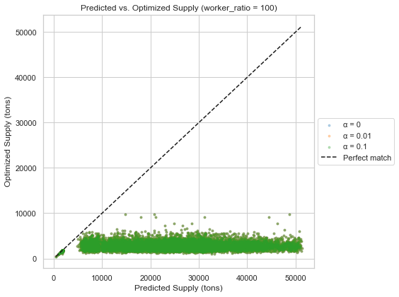

# FMCG-supply-chain-optimization
## Table Of Contents
- [Description](#description)
  - [About the Project](#about-the-project)
  - [Why This Project](#why-this-project)
- [Data](#data)
  - [Dataset](#dataset)
  - [Filtering](#filtering)
- [Methodology](#methodology)
  - [Regression Model](#regression-model)
  - [Optimization Model](#optimization-model)
- [Results](#results)
- [Conclusion](#conclusion)

---

## Description
### About the Project

In this project I have chosen a dataset from [Supply Chain Optimization for a FMCG Company](https://www.kaggle.com/datasets/suraj9727/supply-chain-optimization-for-a-fmcg-company/data) that has information related to the business of a leading FMCG company. You can view the dataset [here](FMCG_data.csv). 

### Why This Project

This project involves **Machine Learning** and **Operations Research** by predicting the product supply to warehouses using the given data by performing a simple linear regression fit and then optimizing using real world constraints to determine the optimal amount of product to be sent to each warehouse. This is done using the Python libraries **pandas**, **seaborn**, **cvxpy**, **Matplotlib** and **scikit-learn**. 

## Data
### Dataset

The dataset contains information on 25000 warehouses about the warehouse ID, location type and zone, market competitors, frequency of issues in transport, storage etc. The columns contain a mix of numerical and alphabetical values. For modeling purpouses, only the numerical values were used.

### Filtering

In order to determine the relevant features to predict the value of 'product_wg_ton', the following correlation heatmap was used:

From the heatmap, it can be seen that the four variables `storage_issue_reported_l3m`, `wh_est_year`, `wh_breakdown_l3m`, `transport_issue_l1y` were the most relevant, and hence were chosen as the features for the regression model. After dropping the rows with empty cells in these columns, the 12,581 remaining rows were used for prediction and optimization.

## Methodology

### Regression Model

Using the four selected features, a linear regression model using `scikit-learn` with an 80:20 split of training and test data. The prediction from the regression model acheived the following error scores:

- Mean Absolute Error : 1527.79
- Root Mean Squared Error : 2058.13
- R² Score : 0.9694

The residuals from the regression model were plotted to check for bias.

### Optimization Model

In order to build an optimization model, we take into consideration two additional variables in addition to the features used for the regression model:
 - `dist_from_hub` : The distance of each warehouse from the production hub.
 - `workers_num` : The number of workers employed at each warehouse.

The goal of the constrained optimization problem was to allocate the product such that:
 - The difference between the prediction and the optimized product weight is minimized
 - Warehouses at large distances from the production hub are penalized to reduce transportation costs.

Hence, the objective function was defined as :
(optimized - predicted)² + `alpha` × (distance × supply)
where `alpha` is a tunable parameter to control the penalty for distance.

For the constraints, one important limit was the amount of product that can be handled by each worker in the warehouses, thus limiting the supply to be sent. Thus the constraints were:
 - Supply must be *non-negative*
 - Supply must be *less than* `worker_ratio` x `workers_num`
   where `worker_ratio` ia a parameter which determines the weight of product in tons that can be handled by each worker

## Results

In order to gain an understanding of how the two parameters `alpha` and `worker_ratio` affect the result, the Predicted vs. Optimized supply was splotted for different combinations of values of these parameters. 

The final result with `worker_ratio = 500` and `alpha = 0.1` can be viewed [here](optimized_zupply_output.csv).

## Conclusion

- Outliers in residuals suggest rare warehouse types.
- Rounding can be applied during implementation to avoid fractional product weights.
- Only 12581 out of 25000 warehouses were included in optimization due to missing values in key features.
- The values of `worker_ratio` strongly influence the finl product weight allocations.
- Larger `worker_ratio` values lead to optimal product weighjts close to the regression prediction.
- The distance penalty `alpha`causes supply to avoid far warehouses.
- The optimized product weights are closest to the predicted values when `worker_ratio` is large and far away warehouses are not penalized (`alpha = 0`).
